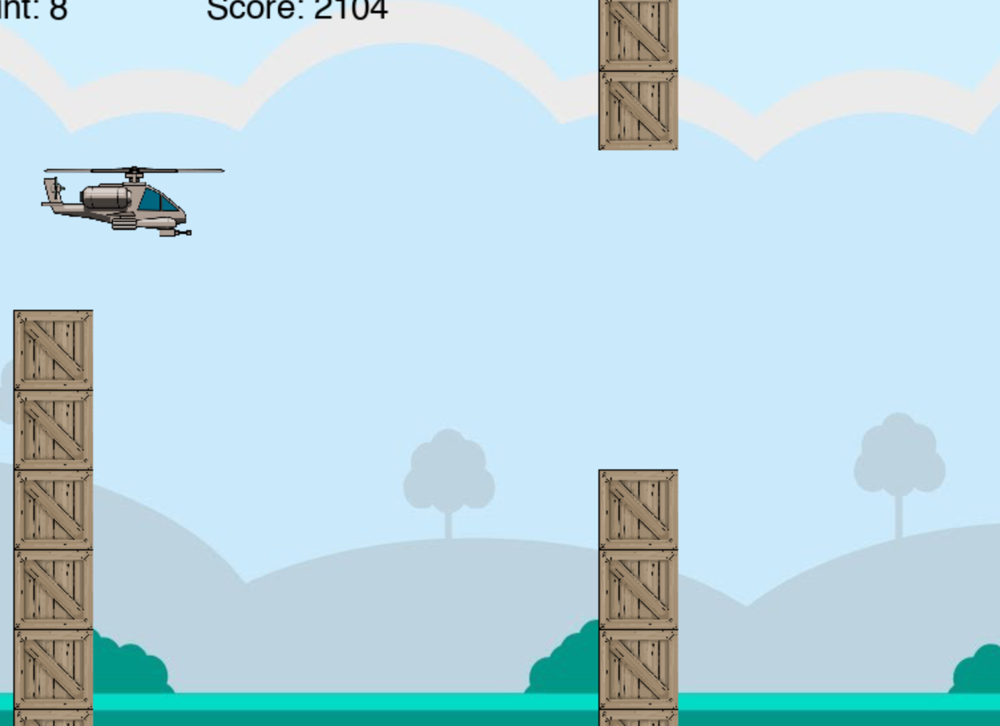

# About this project

This was a project for Amirkabir University's Computational Intelligence course.
<br><br>
In this project, a simple 2D minigame is implemented. <br>
The agent(helicopter) should learn how to cross the obstacles and finish the game
<br>

# Algortithms
<br>In order to implement this project we should implement two algorithms
- Genetic Algorithm
- Neural Network
# Built With
in order to run this project, following libraries should be installed
- Numpy
- pygame
- matplotlib


## Getting Started
to run the game in helicopter mode use the command below
```shell
python game.py --mode helicopter --play True
```
to run the game in gravity mode use the command below
```shell
python game.py --mode gravity --play True
```
to run the game in thrust mode use the command below
```shell
python game.py --mode thrust --play True
```


## Screenshots


## Contributors
- [Matin Tavakoli](https://github.com/MatinTavakoli/) <br>
- [Arshia Rahimi](https://github.com/ArshiaRahimi)


